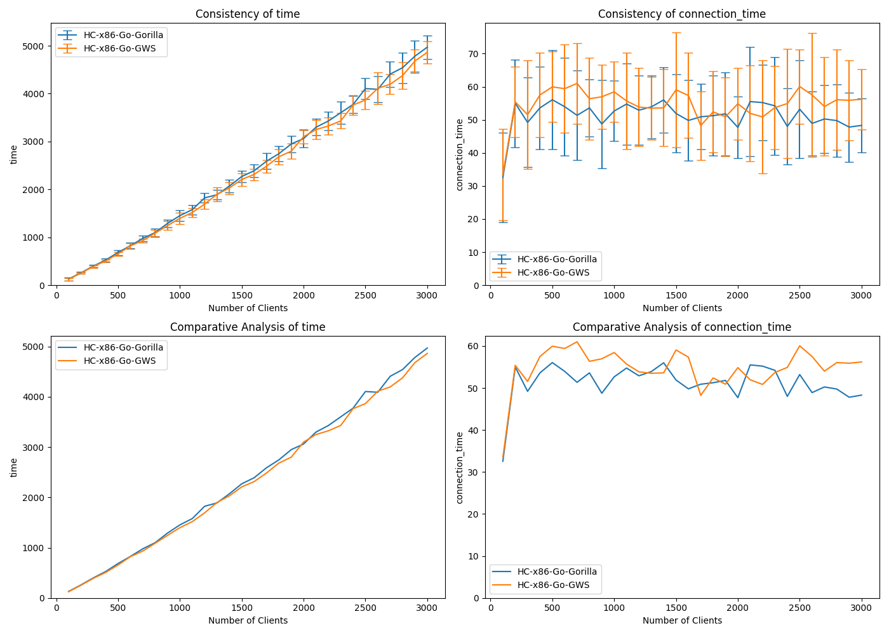

# Go Websocket Benchmark Server (Docker)

Based on [Go (Gorilla)](https://github.com/matttomasetti/Go-Gorilla_Websocket-Benchmark-Server) repository,
[Websocket Performance Comparison](https://matttomasetti.medium.com/websocket-performance-comparison-10dc89367055) article
and it's comments, implemented potentially faster Go Websocket server to be fairly compared with other technologies (languages).

*GWS* had been chosen from [this comparison](https://github.com/lxzan/go-websocket-testing).

~~It was my first Go experience, I have no idea what I'd done there, but it worked~~


## Benchmarking client

The benchmarking client can be found [here](https://github.com/wiz00/Websocket-Benchmark-Client)

## Install & run

```bash
docker build . -f Dockerfile.GWS -t websocket_benchmark/go-gws && \
docker run --rm -p 8080:8080 websocket_benchmark/go-gws
```

or

```bash
./start.sh
```

## Comparison of Go websocket servers performance

Tested on a Hetzner Cloud server instance CPX11 (2 vCPU x86 AMD EPYC™️ 7002 series, 2 GB RAM) scoring 976 points in [Geekbench 5 Single-Core test](https://browser.geekbench.com/v5/cpu/22659970) (tests run using Docker containers).



This particular test was run on localhost using this [benchmarking client](https://github.com/wiz00/Websocket-Benchmark-Client) and these settings:

| Parameter | Value |
| --- | --- |
| Number of test repetitions | 20 |
| Number of rounds per repetition | 30 |
| Connections to be added per round | 100 |
| Requests each connection makes per round | 100 |

The test started with 100 connections sending 10k requests in total and ended up with 3000 connections sending 300k requests in total per round. This was repeated 20 times.

In the results, there is not much of a difference.
I expected to see better results for GWS (or worse for Gorilla) according to the mentioned [comparison](https://github.com/lxzan/go-websocket-testing).

Anyway, GWS was chosen to proceed to the main benchmark and comparison.

## Other websocket servers

* [Node](https://github.com/wiz00/Websocket-Benchmark-Node)
* [Python](https://github.com/wiz00/Websocket-Benchmark-Python)
* [PHP](https://github.com/wiz00/Websocket-Benchmark-PHP) ❤️
* [Go](https://github.com/wiz00/Websocket-Benchmark-Go) (current)

## Original comparison

* [Websocket Performance Comparison](https://matttomasetti.medium.com/websocket-performance-comparison-10dc89367055)
* [Technical Report](https://www.researchgate.net/publication/348993267_An_Analysis_of_the_Performance_of_Websockets_in_Various_Programming_Languages_and_Libraries)

## Original GitHub repositories

* [Benchmarking Client (NodeJS)](https://github.com/matttomasetti/NodeJS_Websocket-Benchmark-Client)
* [C (LWS)](https://github.com/matttomasetti/C-LWS_Websocket-Benchmark-Server)
* [C++ (uWS)](https://github.com/matttomasetti/CPP-uWS_Websocket-Benchmark-Server)
* [C# (Fleck)](https://github.com/matttomasetti/CS-Fleck_Websocket-Benchmark-Server)
* [Go (Gorilla)](https://github.com/matttomasetti/Go-Gorilla_Websocket-Benchmark-Server)
* [Java (WebSocket)](https://github.com/matttomasetti/Java-WebSocket_Websocket-Benchmark-Server)
* [NodeJS (uWS)](https://github.com/matttomasetti/NodeJS-uWS_Websocket-Benchmark-Server)
* [PHP (Ratchet)](https://github.com/matttomasetti/PHP-Ratchet_Websocket-Benchmark-Server)
* [Python (Websockets)](https://github.com/matttomasetti/Python-Websockets_Websocket-Benchmark-Server)
* [Python (Autobahn)](https://github.com/matttomasetti/Python-Autobahn_Websocket-Benchmark-Server)
* [Python (Aiohttp)](https://github.com/matttomasetti/Python-Aiohttp_Websocket-Benchmark-Server)
* [Rust (WebSocket)](https://github.com/matttomasetti/Rust-WebSocket_Websocket-Benchmark-Server)
